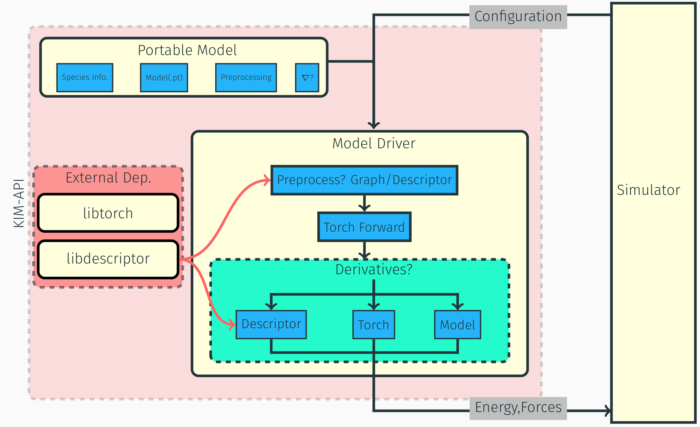

# Design

## Introduction
The Torch ML model driver works by converting the inputs from the simulator to the
required format and `torch.tensor` objects. These tensors are then used by the Torch
model (using Pytorch C++ API, libtorch) to calculate the energy. If the mode
provides a tuple of two `torch.tensor` objects, the second tensor is used as forces, otherwise
the forces are calculated using the energy tensor, and running the backward pass.

The information on whether the model provides forces is stored as one of the
fields in the portable model file.



## Portability
The model driver is designed to be portable across different simulators. This is ensured
by the KIM API, which provides a common interface for the simulators to interact with the
model driver. 

To make the model portable, the model only packs the information that is required to run the model
in the model driver. This includes a TorchScript model file (obtained by `torch.jit.script` module), 
and a parameter file. The parameter file contains the information about the model, such as the cutoff
radius, number of species etc. For descriptors, it also needs to have additional parameter file
to save the descriptor hyperparameters.

For descriptor based models, the Torch model only provides the gradients with respect to
the descriptors, hence additional libraries are required to calculate the forces. 
The model driver uses the [`libdescriptor`](https://github.com/openkim/libdescriptor) library to calculate the forces.
That is in the computation step shown below,
```{math}
\mathbf{F} = \frac{dE}{d\mathbf{r}} = \frac{dE}{d\mathbf{d}} \frac{d\mathbf{d}}{d\mathbf{r}}
```
the {math}`\frac{d\mathbf{d}}{d\mathbf{r}}` is calculated using the `libdescriptor` library,
and forces are computed using the chain rule.

## Computation
The computation is done in the following steps,
1. The model driver reads the input from the simulator, and converts it to the required format.
2. The model driver then calls the Torch model to calculate the energy
3. compute the gradients of the energy with respect to the input
4. if the input is the descriptor, then calculate the gradients with respect to the positions using libdescriptor
5. return the energy and forces to the simulator
